# Poké Prog

Poké Prog é um jogo (em desenvolvimento) com a proposta de ensinar os conceitos básicos de programação
para iniciantes.

O jogo possui uma região fictícia divida em 7 cidades, onde cada uma delas apresenta um conceito distinto de
programação, como por exemplo: variáveis, laços de repetição e decisão, arrays, funções e etc. O objetivo do
jogador é percorrer as 7 cidades em busca do título de melhor programador da região.

## Fase 1

Nessa fase o jogador é apresentado aos conceitos de variáveis, o jogador será
induzido a informar o tipo de cada variável dentro de uma caixa, utilizando para isso o
teclado Unown (Espécie Pokémon que simula o alfabeto), onde os mesmo poderão ser arrastados para formar
palavras.

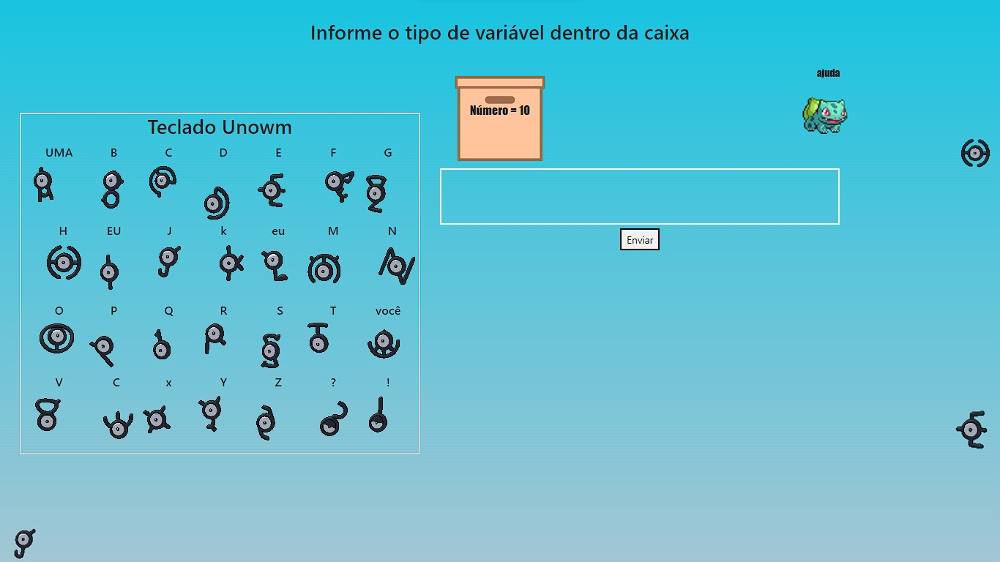

## Fase 2

Nessa fase o jogador participará de uma batalha Pokémon, onde o objetivo é elucidar os conceitos
de decisão, caso erre a questão apresentada na tela o Pokémon do jogador receberá um
ataque e caso acerte poderá atacar o Pokémon oponente.

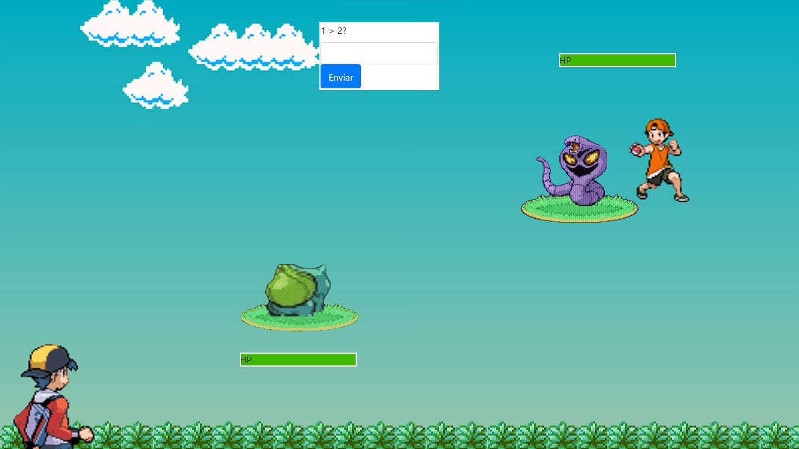

## Fase 3

Na terceira fase, o jogador é levado a construir uma ponte, onde cada bloco para
realizar a construção está em um determinado lado da tela, sendo necessário capturar os
blocos e levá-los um a um ao lado contrário da tela, realizando o processo de coletar os
blocos até formar a ponte completa, repassando assim o conceito de repetição.

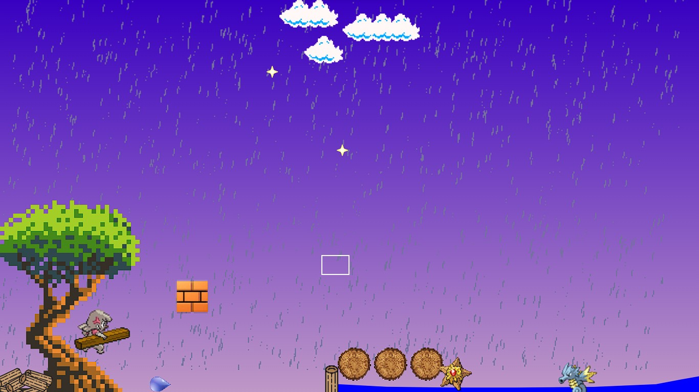

## Fase 4

Na quarta fase o jogador conhece o Pokémon Falinks, sendo este uma
espécie de Pokémon que consegue se dividir em diversas partes, podendo ser utilizado
assim para simular um Array. Nessa fase, o jogador é levado a coletar as partes do Falinks,
que ao serem coletadas vão sendo colocadas em um vetor de Falinks.

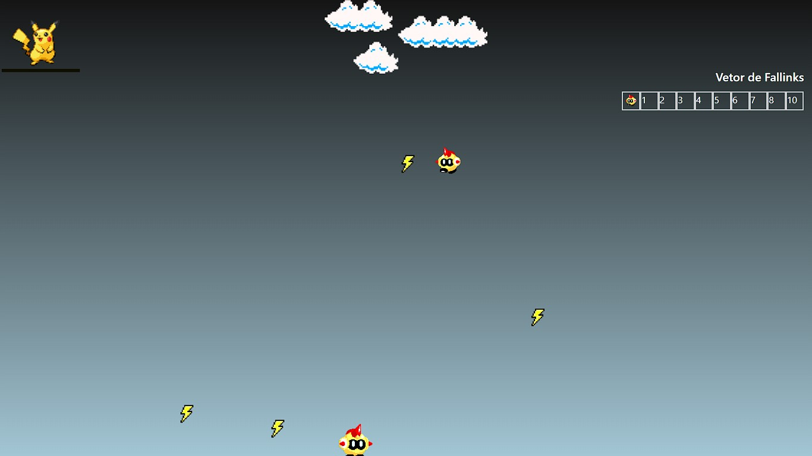

## Fase 5

Na quinta fase o jogador é direcionado a uma casa, onde o objetivo é realizar
a organização da mesma, para isso eles devem utilizar o Pokémon Rotom que possui a
capacidade de se transformar em diversos objetos, como por exemplo uma máquina de
lavar, um forno, um ventilador, um cortador de grama ou uma geladeira,
sendo utilizado para realizar as correções dentro da casa, onde cada um dos objetos o
direciona para uma atividade diferente. Estas atividades fazem o usuário compreender a
importância das funções e apresentar a forma como elas conseguem deixar os códigos de
programação mais limpos e eficientes.

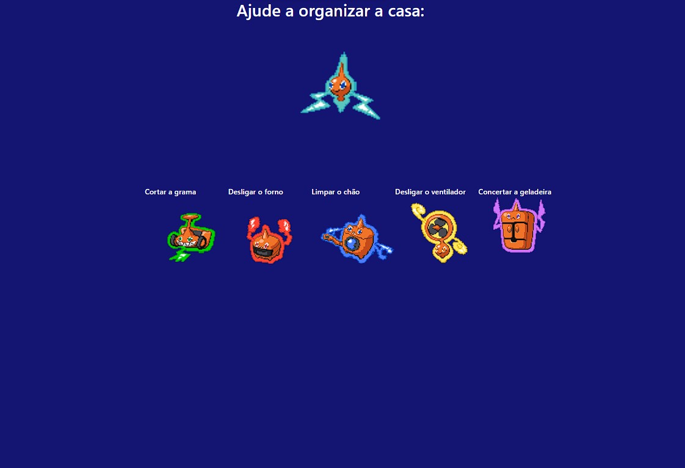

### ● Cortador de grama e lavadeira:

O jogador precisa atirar nos intrusos e coletar os elementos de eletricidade para ligar o aparelhos e fazer com
que eles cortem a grama e limpem a sujeira.

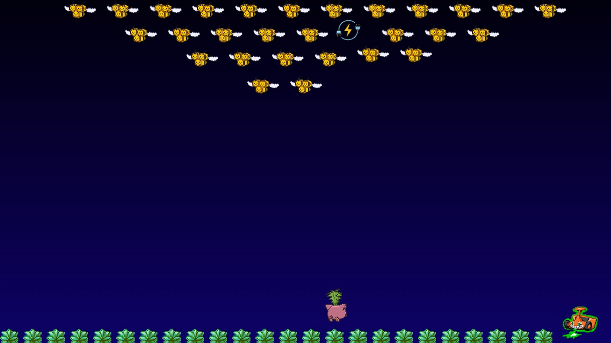

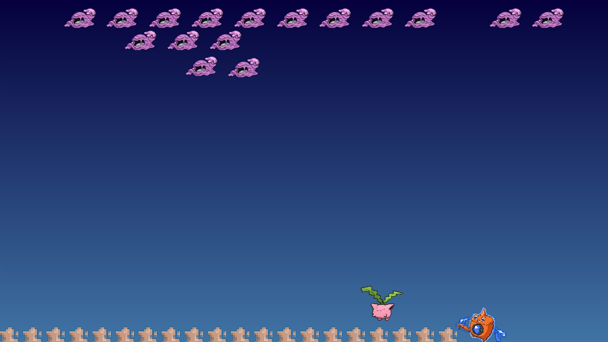

### ● Ventilador:

Para desligar o ventilador, o usuário deve coletar o máximo de frutas que conseguir durante um determinado
tempo, após esse período ele deve se esconder da ventania atrás de uma das pilastras disponíveis para não
ser carregado pelo vento e perder as frutas que coletou. Após um determinado número de frutas coletadas o
ventilador sofrerá um ataque, ao esvaziar a vida do ventilador, o mesmo será desligado.

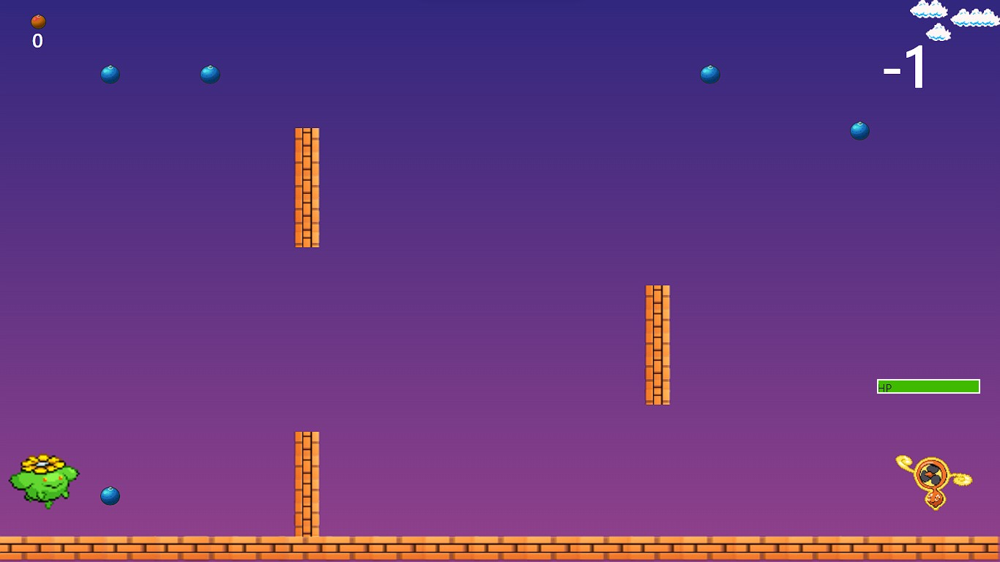

### ● Forno:

Para desligar o forno, o jogador deve desviar das comidas que estão sendo lançadas por ele e atirar enquanto
evita os ataques, o jogador pode utilizar um ataque especial ao preencher a barra secundária abaixo da vida do
inimigo.

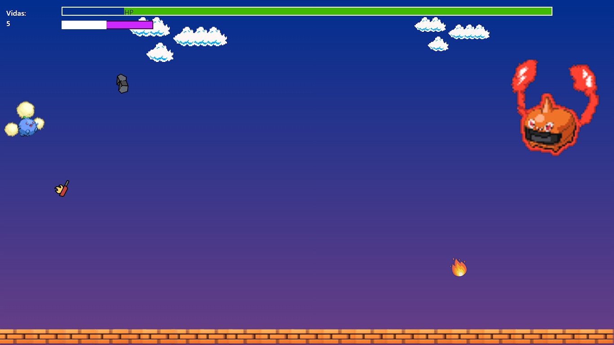

### ● Geladeira:

O jogador deve arrastar os itens para os quadrados correspondentes para consertar a geladeira.

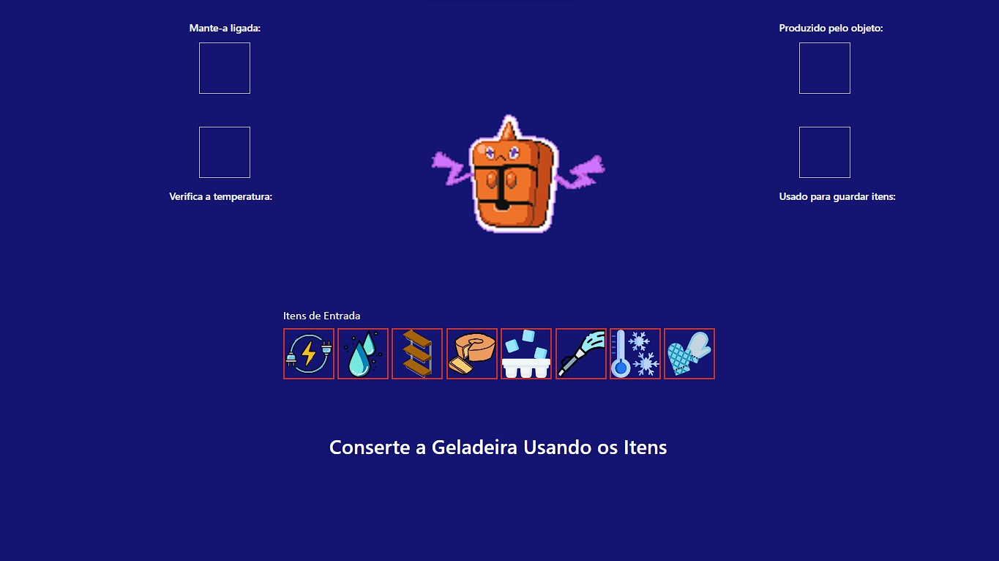

## Fase 6

Na sexta fase o usuário é colocado em um templo recursivo onde a missão do mesmo
é subir as escadas coletando chaves que utilizam o conceito da sequência de Fibonacci para
poder sair do local, ao coletar um determinado número de chaves da sequência, o jogador
consegue sair do templo e avançar à última fase.

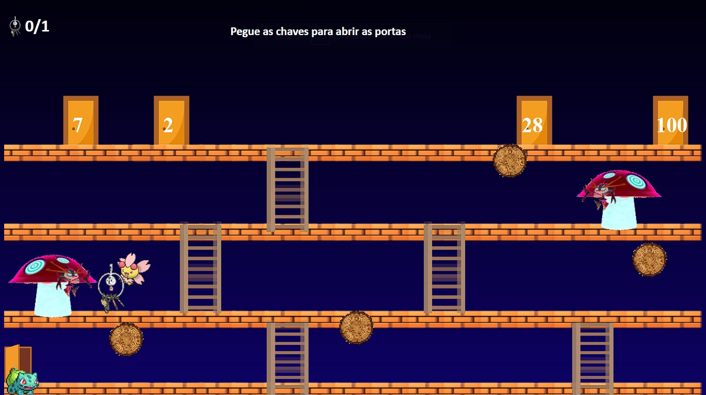

## Fase 7

Na sétima fase o usuário é apresentado ao conceito de exceções e é direcionado
a capturar os Pokémon Shinies, que são Pokémon de uma mesma espécie que possuem
uma coloração diferente. Através dessa fase o usuário é levado a conhecer os
conceitos de tratamento de exceções e sobre a importância de tratar esses erros.

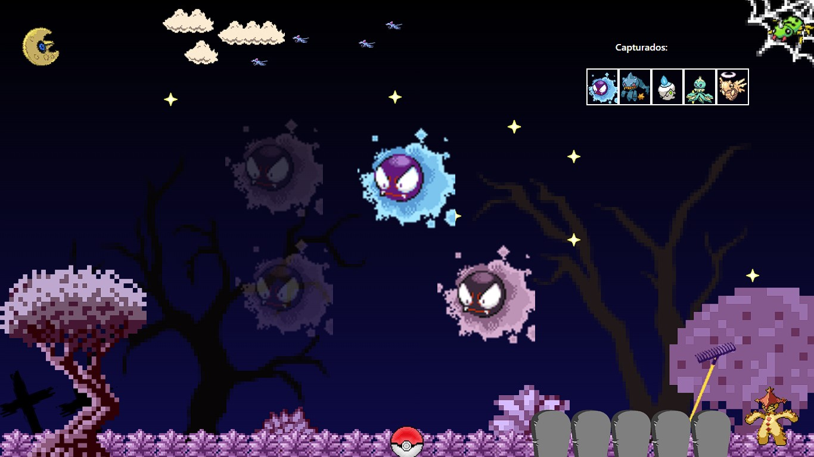

## Extras

Jogos extras também serão implementados com o objetivo de estimular o raciocínio lógico dos jogadores,
como por exemplo o famoso jogo torre de hanoi.

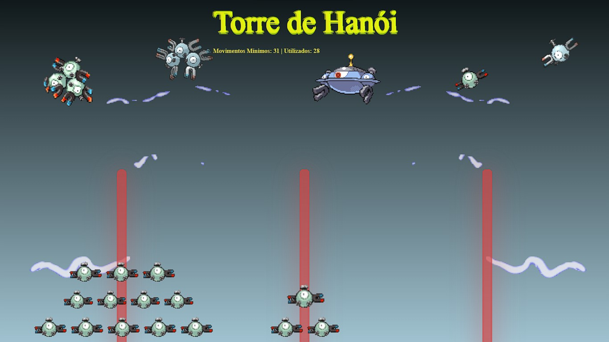

Atualmente o jogo se encontra em prossesso de desenvolvimento e aprimoramento, podendo ser acessado através desse link:
https://jeanlucamtp12.github.io/Poke_Prog/electron/telaInicial/city.html